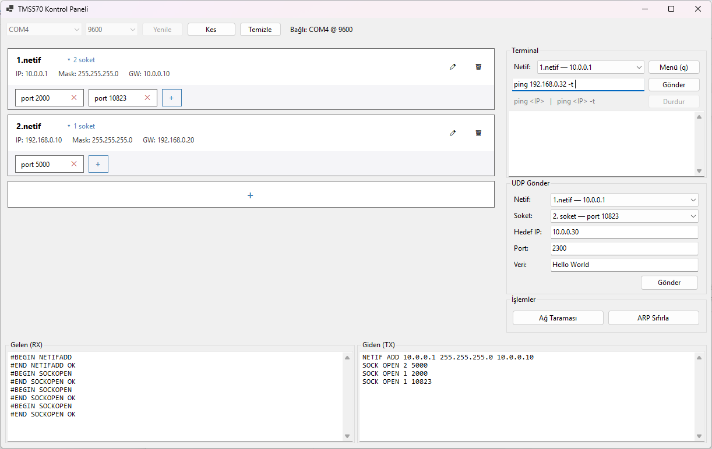

# Runtime Multi-IP UDP Networking — TMS570LC43 / lwIP

Runtime-configurable multiple-IP networking for the TI Hercules **TMS570LC43** (LAUNCHXL2),
built on **lwIP 1.4.1** (bare-metal, `NO_SYS`). Network interfaces and UDP sockets can be
created, configured, and destroyed **at runtime** — from a serial terminal **or from the
included Windows desktop control panel**. Includes ICMP ping, ARP-based network scanning,
and UDP send/receive.

---

## Table of Contents
1. [What This Is](#what-this-is)
2. [Features](#features)
3. [Requirements](#requirements)
4. [Desktop Control Panel](#desktop-control-panel)
5. [Control Protocol](#control-protocol)
6. [Architecture](#architecture)
7. [Module Map](#module-map)
8. [Key Concepts](#key-concepts)
9. [Build & Flash](#build--flash)
10. [Serial Terminal Usage](#serial-terminal-usage)
11. [Configuration](#configuration)
12. [Public APIs (for extending)](#public-apis)
13. [Testing & Verifying](#testing--verifying)
14. [Known Limitations](#known-limitations)
15. [Roadmap](#roadmap)
16. [Glossary](#glossary)

---

## What This Is
The board runs a single physical Ethernet MAC (EMAC) but exposes **multiple IP addresses**
via **IP aliasing** — several lwIP `netif`s sharing one EMAC/MAC. Originally these interfaces
and their UDP sockets were fixed at compile time. This project makes the whole thing
**dynamic**: you add/remove interfaces, open/close UDP sockets on any interface, edit
addresses, send/receive UDP, ping, and scan the local network — all live.

There are two ways to drive it:

- **Serial menu** — the original human-oriented text menu, unchanged.
- **Desktop control panel** — a Windows GUI that speaks a structured command protocol to the
  board. No terminal, no manual text entry.

## Features
- **Dynamic netifs** — add / remove / reconfigure (IP, netmask, gateway) alias interfaces at runtime.
- **Dynamic UDP sockets** — open / close sockets on any netif; each is a full bidirectional endpoint.
- **Automatic RX** — the main loop polls the whole socket registry, so any socket you open is
  received automatically.
- **UDP send** — pick a socket, give a destination IP/port, send a message.
- **ICMP ping** — echo request/reply over the RAW API with round-trip-time measurement.
- **ARP network scan** — host discovery across the netif's subnet.
- **Structured control protocol** — a machine-readable command/response channel alongside the
  human menu, so tooling doesn't have to screen-scrape menu text.
- **Desktop control panel** — auto-refreshing GUI for all of the above (see below).
- **Safe lifecycle** — removing a netif cascades to tear down its sockets; the physical netif is
  protected from removal; stale socket handles are detected (generational ids).

## Requirements
| Item | Value |
|---|---|
| Board | TI Hercules **TMS570LC43** (LAUNCHXL2-TMS570LC43) |
| TCP/IP stack | lwIP **1.4.1**, `NO_SYS = 1` (bare-metal), big-endian |
| Drivers | HALCoGen-generated (`HL_` prefix) |
| Toolchain / IDE | TI ARM compiler, Code Composer Studio (CCS 12.x) |
| Debug probe | XDS110 (on-board) |
| Serial | SCI/UART (`sciREG1`) — **9600 baud, 8N1** |
| Desktop panel (optional) | Windows + .NET 10 Desktop Runtime; Visual Studio 2022+ to build |

---

## Desktop Control Panel

A **C# / .NET 10 / WinForms** application in [`TmsControlPanel/`](TmsControlPanel/) that
controls the board over the serial port through the [control protocol](#control-protocol).

<!-- Add a screenshot at docs/control-panel.png and it will render here -->


### What it gives you
- **Auto-refreshing netif cards** — every interface is a card showing IP / netmask / gateway.
  The list refreshes itself (~2s) so adding or removing an interface shows up without any
  manual refresh. The UI only redraws when something actually changed, so there's no flicker.
- **Per-card actions** — ✏ edit (IP / netmask / gateway), 🗑 delete. Clicking a card expands a
  strip of its UDP sockets, each with a delete button, plus a **+** to open a new socket.
- **"+" card** — adds a new interface from IP / netmask / gateway fields.
- **Terminal** — a persistent netif selector plus `ping <IP>` and `ping <IP> -t`. The repeat
  loop runs in the app with a **Stop** button (no Ctrl+C signalling needed).
- **UDP send panel** — choose netif and socket, enter destination IP/port and payload.
- **Network scan** and **ARP reset** buttons.
- **RX / TX logs** — read-only views of everything received from and sent to the board.
- Remembers the last used COM port and baud rate.

### Running it
Build and run from Visual Studio (open `TmsControlPanel/TmsControlPanel.slnx`, press F5), or
produce a standalone executable:

```bash
dotnet publish TmsControlPanel/TmsControlPanel.csproj -c Release -r win-x64 --self-contained true -p:PublishSingleFile=true
```

The result is a single `TmsControlPanel.exe` under
`TmsControlPanel/bin/Release/net10.0-windows/win-x64/publish/` that runs on any Windows x64
machine. Use `--self-contained false` for a much smaller executable that instead requires the
.NET 10 Desktop Runtime to be installed.

Then: pick the board's COM port, leave the baud at **9600**, and press **Bağlan** (Connect).

### Code layout
| File | Responsibility |
|---|---|
| `SerialManager.cs` | Sole owner of the serial port. Sends commands and awaits their framed responses; raises RX/TX/event callbacks on the UI thread. |
| `Protocol.cs` | Parses protocol lines into `NetifInfo`, `SocketInfo`, `PingReply`, `ScanHost`. |
| `Form1.cs` | Wiring: connection, auto-refresh polling, card actions, ping loop, scan, UDP send. |
| `NetifCard.cs` / `AddNetifCard.cs` | The netif card control and the trailing "+" (add interface) card. |
| `NetifEditDialog.cs` / `InputDialog.cs` | Edit-address dialog; small single-value prompt. |
| `AppSettings.cs` | Remembers last COM port / baud in `%AppData%\TmsControlPanel\settings.json`. |

---

## Control Protocol

Alongside the human menu, the firmware exposes a **line-based command channel**. The main loop
feeds every byte that isn't the menu trigger (`q`) into `cmd_channel_feed()`; a line terminated
by CR (`\r`) is dispatched as a command. It never blocks the main loop, and it does **not** echo
input.

### Commands
| Command | Effect |
|---|---|
| `NETIF LIST` | List all interfaces and their sockets |
| `NETIF ADD <ip> <mask> <gw>` | Create an alias interface |
| `NETIF DEL <idx>` | Remove an interface (cascades its sockets) |
| `NETIF SET <idx> IP\|MASK\|GW <value>` | Change one address field |
| `SOCK OPEN <idx> <port>` | Open a UDP socket on an interface |
| `SOCK CLOSE <idx> <nth>` | Close the *nth* socket of an interface |
| `PING <idx> <ip>` | One ICMP echo attempt from that interface |
| `SCAN <idx>` | ARP host discovery on that interface's subnet (~13s) |
| `ARPRESET` | Clear the ARP cache on all interfaces |
| `UDP SEND <idx> <nth> <ip> <port> <data>` | Send a UDP payload from that socket |

`<idx>` is the **1-based position** of the interface in `NETIF LIST` output (the same order the
menu uses). `<nth>` is likewise the 1-based position of a socket within its interface.

### Responses
Every command replies with a framed block:

```
#BEGIN <NAME>
<zero or more data lines>
#END <NAME> OK
```

Failures end with `#END <NAME> ERR:<reason>` (e.g. `ERR:bad_args`, `ERR:bad_index`,
`ERR:remove_failed`). An unrecognised command yields `#ERR unknown_command`.

Data lines:

| Line | Meaning |
|---|---|
| `#NETIF <idx> <ip> <mask> <gw> socks=<n>` | One interface |
| `#SOCK <netifIdx> <nth> <port>` | One socket, belonging to the preceding interface |
| `#PONG <from> <seq> <bytes> <rtt_ms> <ttl>` | Ping reply |
| `#TIMEOUT` | Ping attempt timed out |
| `Host up: <ip>  MAC <mac>` | A host found by `SCAN` |

Unsolicited events are prefixed `#EVT` so they can arrive at any time — even in the middle of a
response — without being mistaken for command output:

```
#EVT UDPRX 10.0.0.5:4000 -> 10.0.0.10:3000 12 bayt
#EVT Data: hello world
```

Example exchange:

```
->  NETIF LIST
<-  #BEGIN NETIFLIST
<-  #NETIF 1 10.0.0.10 255.255.255.0 10.0.0.1 socks=1
<-  #SOCK 1 1 5000
<-  #NETIF 2 192.168.0.1 255.255.255.0 192.168.0.10 socks=0
<-  #END NETIFLIST OK
```

---

## Architecture

```
┌────────────────────────────┐   ┌────────────────────────────┐
│  terminal_interface.c      │   │  command channel           │
│  human serial menu         │   │  (same file) — structured  │
│                            │   │  commands for the GUI      │
└─────────────┬──────────────┘   └─────────────┬──────────────┘
              │                                │
              └───────────────┬────────────────┘
                              │ calls
        ┌─────────────────────▼──────────┐   ┌──────────────────┐
        │  net_manager.c                 │   │  ping.c          │
        │  net_if_add / net_if_remove    │   │  ICMP echo (RAW) │
        │  (cascade + guards)            │   │  + ARP scan      │
        └──────┬──────────────────┬──────┘   └────────┬─────────┘
               │                  │                   │
   ┌───────────▼────────┐  ┌──────▼───────────────┐   │
   │  lwiplib.c         │  │  UDP_source.c        │   │
   │  alias netif       │  │  socket registry     │   │
   │  add / remove      │  │  (id + generation)   │   │
   └───────────┬────────┘  └──────────┬───────────┘   │
               │                      │               │
        ┌──────▼──────────────────────▼───────────────▼──────┐
        │                   lwIP 1.4.1 core                  │
        │      netif_list · udp_pcb · raw_pcb · etharp       │
        └───────────────────────────┬────────────────────────┘
                                    │
                        ┌───────────▼───────────┐
                        │     EMAC + PHY        │  one physical MAC,
                        │     (HALCoGen)        │  shared by all netifs
                        └───────────────────────┘
```

- **Main loop** (`lwip_main.c`): initializes hardware + lwIP, then loops forever polling all
  sockets for RX, watching for the menu trigger, and feeding other bytes to the command
  channel. EMAC RX/TX run in ISRs.
- **Routing**: incoming packets are steered to the correct netif by `netif_alias_route_filter`
  (walks `netif_list` matching the destination IP).

## Module Map
| File | Responsibility |
|---|---|
| `example/hdk/src/lwip_main.c` | App entry (`EMAC_LwIP_Main`): init, main loop (RX poll + terminal + command channel), EMAC ISRs |
| `lwip-1.4.1/ports/hdk/lwiplib.c` | lwIP core init + **alias netif pool** (`lwIPAliasAdd`/`Remove`, `lwIPNetifPtrGet`) |
| `src/UDP_source.c` / `include/UDP_source.h` | **UDP socket registry** — id/generation, open/close/send/poll, per-netif enumeration |
| `src/net_manager.c` / `include/net_manager.h` | Thin orchestration — `net_if_add` / `net_if_remove` (cascade) |
| `src/terminal_interface.c` / `include/terminal_interface.h` | Serial menu, user commands, **and the structured command channel** |
| `src/ping.c` / `include/ping.h` | ICMP echo (ping) over the RAW API + ARP network scan |
| `src/netif_alias_filter.c` | Incoming-packet routing across aliased netifs |
| `example/hdk/inc/lwipopts.h` | lwIP configuration overrides (see below) |
| `TmsControlPanel/` | Windows desktop control panel (C# / .NET 10 / WinForms) |

## Key Concepts
- **IP aliasing** — multiple `netif`s on one EMAC/MAC. The **primary (physical) netif** owns the
  hardware (PHY reset/autoneg happen only for it) and is **never removable**. **Alias netifs**
  copy the physical netif's output path and share it; they are the dynamic layer.
- **Generational socket ids** — a socket id packs `(generation << 8) | slot_index`. When a slot
  is reused, its generation increments, so an old (stale) id is detected and rejected. All id
  handling goes through one validation gate, `resolve()`.
- **Registry, not linked lists** — the "sockets of a netif" relationship isn't stored; it's
  derived on demand by scanning the fixed socket array (`s_listeners[]`). Same for netifs.
- **ISR-safe teardown** — the EMAC RX callback runs in interrupt context, so removals do
  `udp_remove` first (stops callbacks) then clear state, inside `SYS_ARCH_PROTECT` critical
  sections. Every `PROTECT` pairs with exactly one `UNPROTECT`.
- **Cascade** — `net_if_remove` removes a netif's sockets **before** the netif, so no socket is
  ever left bound to a removed interface.

## Build & Flash
1. Open the project in **Code Composer Studio** (CCS 12.x) and import this repository.
2. Ensure all source folders are in the build (notably `src/`, `example/hdk/src/`,
   `lwip-1.4.1/...`). New files must be part of the CCS project to be compiled.
3. **Build** (Project → Build). It should compile clean.
4. Connect the board via USB (XDS110) and **Flash/Debug**.
5. Either open the desktop control panel, or open a serial terminal at **9600 8N1** and press
   `q` (or the on-board button, GPIOB[5]) to bring up the menu.

> If the debugger fails with an XDS110 DLL / `SC_ERR_LIB_LOAD_LOCAL` error, it's a probe/driver
> issue (not the code): close CCS, re-plug the XDS110, or reboot the PC.

## Serial Terminal Usage
Send `q` over the serial port (or press the on-board button) to open the menu, then choose a
command by number:

| # | Command | What it does |
|---|---|---|
| 1 | **List Netif's** | Prints every interface with its addresses and sockets. |
| 2 | **Configure Netif** | Select a netif, then edit **IP / netmask / gateway**, or open/delete a socket on it. |
| 3 | **Add/Delete Netif** | Create a new alias netif from IP/netmask/gateway, or remove one (cascades its sockets). |
| 4 | **UDP Data Send** | Select a sender socket, enter `IP/port` (e.g. `192.168.0.1/5000`), type a message. |
| 5 | **Ping an IP address** | Select a source netif, enter a target IP; sends ICMP echo (4 tries) with RTT/TTL. |
| 6 | **Reset the ARP tables** | Clears the ARP cache on all netifs. |
| 7 | **Scan Network** | ARP host discovery across the selected netif's subnet. |

You can also type `ping <IP>` or `ping <IP> -t` directly at the menu; the continuous form runs
until Ctrl+C (byte `0x03`) is received.

Received UDP is printed automatically by the main loop as `#EVT UDPRX …` lines.

> Menu selections are read one character at a time, so choices are limited to `1`–`9`. Line
> input (addresses, ports, messages) is read as a full line and may be multi-digit.

## Configuration
lwIP options are overridden in **`example/hdk/inc/lwipopts.h`** — never edit lwIP's `opt.h`
directly. `opt.h` uses `#ifndef X / #define X default / #endif`, and `lwipopts.h` is included
first, so anything you define there wins.

| Macro | Where | Meaning |
|---|---|---|
| `UDP_MAX_LISTENERS` | `UDP_source.h` | Max sockets in the registry (default 16). Fits in the id's low byte, so ≤ 256. |
| `MEMP_NUM_UDP_PCB` | `lwipopts.h` | Size of lwIP's udp_pcb pool. **Shared** across the whole stack (the locator holds one), so keep it **> `UDP_MAX_LISTENERS`** (set to 20). |
| `MAX_ALIAS_NETIF` | `lwiplib.c` | Max alias netifs. |
| `CMD_LINE_MAX` | `terminal_interface.c` | Longest accepted protocol command line (default 128). |
| `LWIP_RAW`, `LWIP_ICMP` | (default 1) | Required for ping. |

## Public APIs
Use these to build on top of the project.

**Interface lifecycle** (`net_manager.h`)
```c
err_t net_if_add(ip_addr_t *ip, ip_addr_t *mask, ip_addr_t *gw);
err_t net_if_remove(struct netif *netif);   // cascades sockets, guards the physical netif
```

**UDP sockets** (`UDP_source.h`)
```c
err_t udp_source_add_listener(struct netif *netif, u16_t port, udp_sock_id_t *id_out);
void  udp_source_remove_listener(udp_sock_id_t id);
u8_t  udp_source_poll_rx(udp_sock_id_t id, udp_rx_msg_t *msg);
err_t udp_source_data_send(udp_sock_id_t id, struct netif *tx_netif,
                           ip_addr_t *dst, u16_t dst_port, const u8_t *data, u16_t len);
u8_t  udp_source_count_sockets(struct netif *netif);
udp_netif_socket_info_t udp_source_get_socket(struct netif *netif, u8_t nth);
void  udp_source_remove_all_on_netif(struct netif *netif);
```

**Alias netifs** (`lwiplib.h`)
```c
unsigned int  lwIPAliasAdd(unsigned int primaryInst, unsigned int ip, unsigned int mask, unsigned int gw);
void          lwIPAliasRemove(struct netif *netif);
struct netif *lwIPNetifPtrGet(unsigned int inst);        // the physical netif
struct netif *lwIPAliasNetifPtrGet(unsigned int idx);
```

**Ping / scan** (`ping.h`)
```c
err_t ping_send(struct netif *netif, ip_addr_t *target);
u8_t  ping_wait_reply(u32_t timeout_ms, ping_result_t *out);
err_t scan_network(struct netif *n);
```

**Command channel** (`terminal_interface.h`)
```c
void cmd_channel_feed(uint8_t ch);   // feed one received byte; dispatches on CR
```

## Testing & Verifying
- **Desktop panel** — the fastest check: connect and confirm the interface cards populate,
  then add a netif, open a socket, ping, and scan.
- **Wireshark** — capture on the interface facing the board. Filter e.g. `udp.port == 5000` or
  `ip.addr == <board_ip>`. Inspect the IP (src/dst) and UDP (src/dst port) layers and the Data
  payload. Expect an ARP request/reply on the first send.
- **netcat** (to actually receive a sent message): `nc -u -l 5000` on a PC in the board's subnet.
- **ping** — from the board (panel or menu) to a PC, or from a PC to the board's IP.

## Known Limitations
- **Shared udp_pcb pool** — sockets share `MEMP_NUM_UDP_PCB` with the rest of the stack (e.g. the
  locator). Keep the pool above `UDP_MAX_LISTENERS`.
- **Single-character menu selections** — menu choices are limited to `1`–`9` (the protocol
  channel has no such limit).
- **Physical netif is non-removable** — it owns the hardware and the aliases depend on it.
- **ARP scan is link-local** — it only finds hosts in the same L2 broadcast domain, and takes
  ~13 seconds (256 addresses × 50 ms) during which the board is busy.
- **Menu and protocol are mutually exclusive** — while the blocking human menu is open, the
  command channel isn't served; the desktop panel pauses its polling when you open the menu.
- **Big-endian target** — `htonl`/`ntohl` are no-ops here but kept explicit for portability.

## Roadmap
- [x] ARP-based network scan (host discovery) — `etharp_query` + `etharp_find_addr`.
- [x] Structured control protocol + desktop GUI.
- [ ] Open-port scan (TCP/UDP).
- [ ] Service/version detection (banner grabbing) over lwIP TCP.
- [ ] UDP control plane (drive the protocol over Ethernet instead of UART).

## Glossary
- **netif** — lwIP network interface (one IP address + config).
- **alias netif** — an extra netif sharing the physical EMAC/MAC.
- **udp_pcb** — lwIP's UDP "connection" control block.
- **socket id** — this project's handle for a registry socket: generation + slot index.
- **cascade** — removing a netif also removing all its sockets.
- **ISR** — Interrupt Service Routine (EMAC RX/TX run here).
